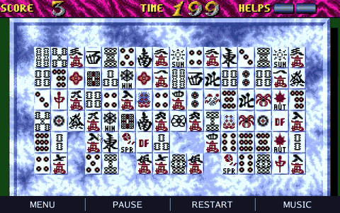
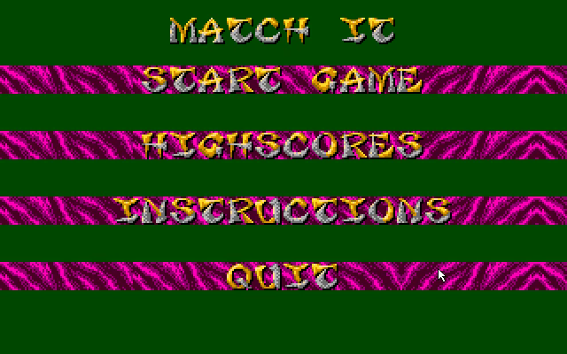
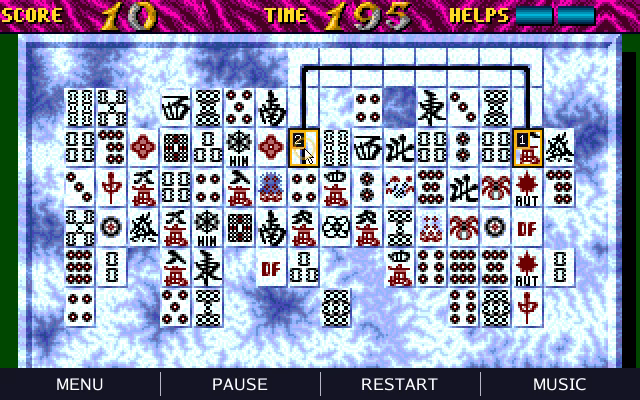
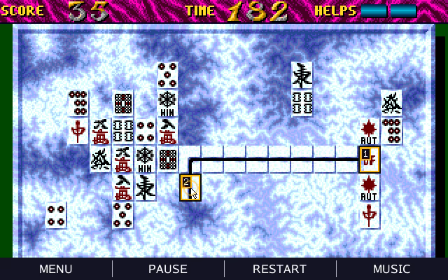

# Match'it — Atari ST puzzle game in Go

A Go/[Ebitengine](https://ebitengine.org/) port of **Match'it**, the tile-matching game released by Delta Force for the Atari ST in December 1990. Clear each board by joining compatible tiles with a path containing no more than two right-angle turns.

The port uses the original pixel artwork, 64 board layouts, matching rules, removal animations, and scoring progression. It adds a resizable desktop window, touch controls, an Android launcher, and embedded assets. The bundled **Chambers of Shaolin — Trapped in China** YM soundtrack plays at 48 kHz through [ym-player](https://github.com/olivierh59500/ym-player).

## Preview

[](https://github.com/olivierh59500/match-it/raw/refs/heads/main/docs/media/preview.mp4)

**[Watch the 30-second MP4 with sound](https://github.com/olivierh59500/match-it/raw/refs/heads/main/docs/media/preview.mp4)** · [Local MP4](docs/media/preview.mp4)

The GIF is silent. The video is a deterministic presentation generated by `cmd/matchit-video`: it solves an embedded board, simulates mouse selections, renders the original assets, and synthesizes the YM music. The excerpt runs from tile matching to the stage completion summary; the screenshots below are frames from the same presentation.

| Main menu | A connection with two turns | Later in the same round |
| --- | --- | --- |
|  |  |  |

## Run on desktop

Use **Go 1.25.5 or newer**, as specified in [go.mod](go.mod), and a desktop graphics session. The project currently uses Ebitengine 2.9.11. On macOS, its native window backend needs the Xcode Command Line Tools. Linux builds need a C compiler, X11/OpenGL development libraries, and ALSA development files for audio; see the pinned [Linux graphics backend](https://github.com/hajimehoshi/ebiten/blob/v2.9.11/internal/glfw/build_linux.go) and [Oto audio requirements](https://github.com/ebitengine/oto/tree/v3.4.1#prerequisite).

```sh
git clone https://github.com/olivierh59500/match-it.git
cd match-it
go run ./cmd/matchit
```

To build a desktop executable:

```sh
go build -o matchit ./cmd/matchit
./matchit
```

On Windows, use `go build -o matchit.exe ./cmd/matchit` and run `matchit.exe`. The game uses a 640×400 logical canvas; resizing the window scales the display uniformly. PNG artwork, level data, and music are embedded in the executable, so no asset conversion is needed to play.

Desktop high scores are saved as `highscores.json` in the working directory. Run the game from a writable directory if you want scores to persist.

## How to play

Choose **START GAME** from the menu, then click or tap two tiles. A successful pair disappears after its removal animation.

- Most tiles must be identical. Any season matches another season, and any flower matches another flower.
- The connection must travel horizontally and vertically through empty spaces, with at most two turns. It may use the empty border around the board.
- Selecting the same tile again cancels the selection. An invalid second tile becomes the new selection.
- You begin with two helps. Using help finds and removes an available pair, spending one help.
- Each removed pair adds one point. Clearing a board adds the remaining time and 100 points per unused help to your score when you continue.
- Completing a board without using help grants one additional help, up to five. The timer speeds up as you advance through stages.
- The game ends when time runs out or no pair can be connected. A qualifying score can be entered into the top-ten table.

### Controls

| Action | Mouse or touch | Keyboard |
| --- | --- | --- |
| Select a tile | Left click or tap | — |
| Use one help | Click or tap the help counter at the top right | `H` |
| Pause or resume | **PAUSE / RESUME** in the bottom bar | `P` |
| Start a fresh board | **RESTART** in the bottom bar | `R` |
| Return to the menu | **MENU** in the bottom bar | `Esc` |
| Mute or unmute music | **MUSIC** in the bottom bar | `M` |
| Continue after clearing a stage | Click or tap | `Enter` |
| Enter a high-score name | On-screen keyboard | Type, `Backspace`, `Enter` |

**RESTART** loads the next board layout and resets its timer while keeping the current score and help count. Music mute applies across screens. The menu includes **INSTRUCTIONS**, **HIGHSCORES**, and **QUIT**.

## Android

The included Android launcher supports phones and tablets in sensor-landscape mode, with the same uniformly scaled 640×400 canvas and touch controls. It targets API 36 and supports devices from API 23 (Android 6.0). Scores are stored in the application's private files directory.

Requirements: Go, **Android SDK with API 36**, an **Android NDK**, and **JDK 17**. Set `ANDROID_HOME` or `ANDROID_SDK_ROOT` if the SDK is in a custom location; `JAVA_HOME` and `ANDROID_NDK_HOME` can select the JDK and NDK. The binding script uses the `ebitenmobile` version matching this project's Ebitengine dependency.

Build, install, and launch the debug application on an authorized USB device with USB debugging enabled:

```sh
./scripts/run-android.sh
```

Build the APK without installing it:

```sh
cd android
./gradlew :app:assembleDebug
```

Gradle builds the Go library automatically. The APK is written to `android/app/build/outputs/apk/debug/app-debug.apk`.

To build just the Android library from the repository root:

```sh
./scripts/build-android-aar.sh
```

The default output is `android/app/libs/matchit.aar`. For an ARM64-only build, set `MATCHIT_ANDROID_TARGET=android/arm64`; set `MATCHIT_KEEP_SYMBOLS=1` when collecting native profiles.

## Generate the presentation video

With FFmpeg available on `PATH` and built with VP9 and Opus encoders:

```sh
go run ./cmd/matchit-video
```

The command generates the full presentation at 640×400 and 60 frames per second, with stereo YM audio at 48 kHz, and writes `media/matchit-desktop-presentation.webm`. It uses embedded game data and does not need a live game window.

| Option | Default | Purpose |
| --- | --- | --- |
| `-output` | `media/matchit-desktop-presentation.webm` | Output file path |
| `-ffmpeg` | `ffmpeg` | FFmpeg executable |
| `-crf` | `34` | VP9 quality, 0–63; lower values increase quality |
| `-audio-bitrate` | `64k` | Opus audio bitrate |
| `-audio-gain` | `8` | Soundtrack gain in dB, from −30 to 20 |

The compact README media lives in [docs/media](docs/media): three native-resolution PNG frames, a silent animated GIF, and a 30-second H.264/AAC MP4 with sound.

## Project layout

| Path | Contents |
| --- | --- |
| `cmd/matchit/` | Desktop launcher |
| `cmd/matchit-video/` | Deterministic presentation renderer and encoder |
| `cmd/convert-assets/` | Atari ST asset-to-PNG converter |
| `internal/game/` | Screens, input, rendering, animation, scores, and music control |
| `internal/logic/` | Board layouts, random ordering, matching, and pathfinding |
| `internal/assets/` | Original-format decoders and asset helpers |
| `internal/audio/` | YM soundtrack playback |
| `assets/` | Embedded runtime PNGs and music |
| `mobile/` | Ebitengine mobile binding |
| `android/` | Android launcher and Gradle project |
| `scripts/` | Android build and install helpers |
| `docs/media/` | README screenshots and previews |

## Development notes

The converted PNG assets are included in the repository. The optional converter reads the original Atari ST files from `old/` or the repository root and writes to `assets/png/`; the original files must be supplied separately. Keep those local originals out of Git.

Runtime PNGs and removal frames are uploaded to Ebitengine during startup. Avoid creating `ebiten.Image` objects from `Draw`. The next available move is recomputed when the board changes; pathfinding uses fixed scratch storage and reuses its destination slice. The desktop launcher skips duplicate draws between 60 Hz updates, while mobile uses Ebitengine's native presentation lifecycle.

Menu text uses the original FONT2 glyphs; instructions and touch controls use a readable system font. Useful manual checks after gameplay changes include tile selection and cancellation, two-turn connections, season/flower matches, help spending, pause and mute, stage bonuses, and desktop/touch high-score entry.

## Credits

- **Original Atari ST game:** Delta Force, December 1990 — code by **New Mode**, graphics by **Slime**.
- **Go conversion:** **Olivier Houte / Malakh Software**.
- **Rendering and input:** [Ebitengine](https://ebitengine.org/).
- **YM playback:** [ym-player](https://github.com/olivierh59500/ym-player); bundled track **Chambers of Shaolin — Trapped in China**.

The original artwork, level data, and soundtrack remain credited to their respective authors.
